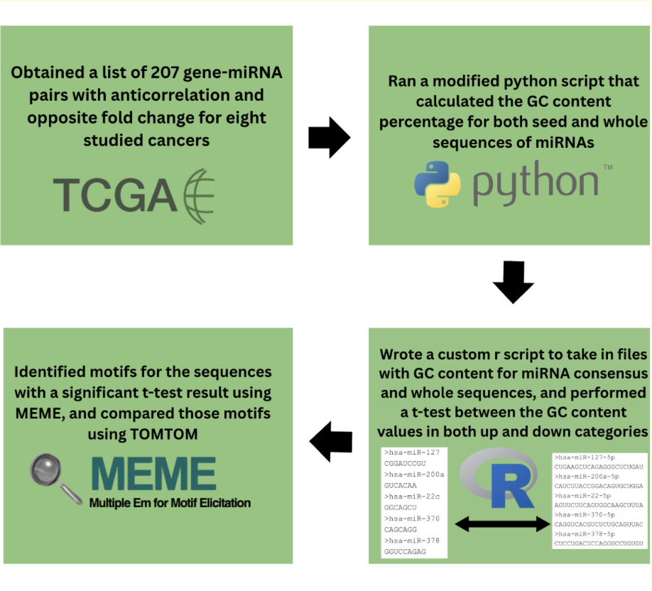
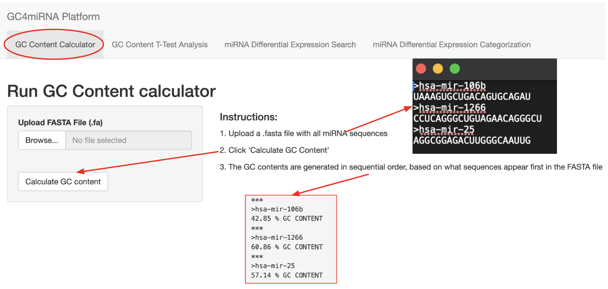
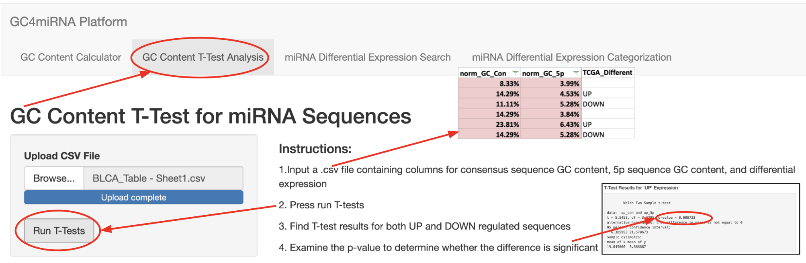
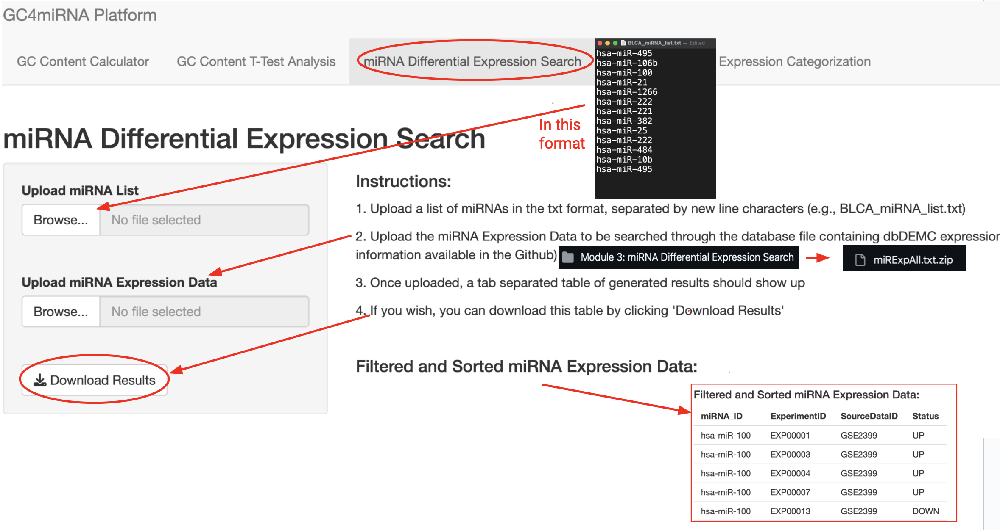
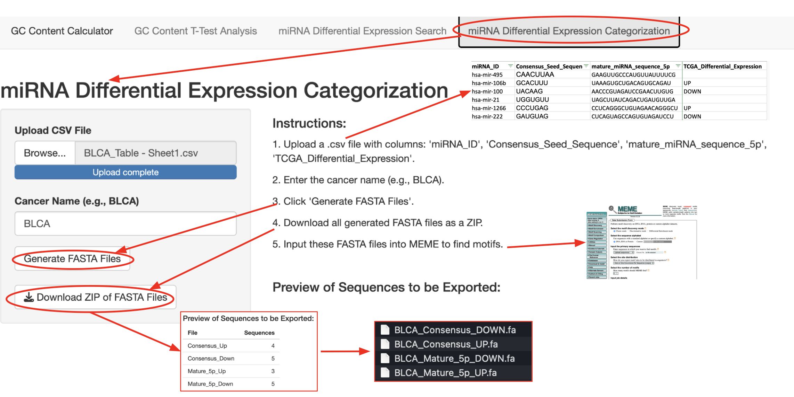

# GC4miRNA - a pipeline for examining impact of GC content in miRNA seed sequences on expression in tumor samples
## Overview
MicroRNAs (miRNAs) are small RNA molecules that play a crucial role in regulating gene expression by binding to and degrading targeted mRNAs. Alterations in the binding site between miRNAs and mRNAs can lead to the dysregulation of genes, and a variety of diseases, including cancers. GC content is an important factor in miRNA binding, since high GC content miRNAs are often more stable and may have a stronger affinity for their targets. To reveal the GC content signature for cancer-associated miRNAs, we developed a R Shiny app called GC4miRNA, which calculates GC enrichment and performs statistical analysis for targeting miRNAs and their seed sequences using customized BASH and R scripts. This combined app can be downloaded in its entirety(GC4miRNA_All.R), or modules can also be used individually. 

## Workflow

## Module 1: GC Content Calculator
This Module's function is to intake a list of miRNA sequences and output a list of GC content for every sequences. 
In order to generate calculations of the GC Content for multiple miRNAs at once, run the module GC_Calculation_App.R in RStudio, and input a fasta file containing your miRNAs. We have an example file called example-2.fa, which can be used to generate GC Content for miRNAs found in our dataset.

gccontent_fixed.sh is the bash script that our R Shiny program uses for its calculation. Please make sure that this script is in the same directory as where you run the app within R_Studio. We would like to credit "Abbys-Amazing-GC-Calculator" for the original code, which we only modified a little bit. It can be found in this directory: https://github.com/abbykatb/Abbys-Amazing-GC-Calculator/blob/master/README.md

## Module 2: GC Content T-test Analysis
This Module performs a T-test comparing the GC content of Consensus and 5p Sequences, within upregulated and downregulated miRNAs
The input file for this module is a csv file containing columns for GC content for consensus and 5p sequences of miRNA, as well as differential expression information that can be found in Module 2. An example file "LIHC-T-test_Sample.csv" is directly from a dataset we used for our research, and it contains many different columns alongside the ones that are read in the program. Our code searches for columns with very specific names, so it is important for the function of this program to modify the code so that it searches for the same column names in your dataset. After pressing "Run T-tests", there should be two Student's T-test that are generated, which are seperated based on whether or not they use data from miRNAs that are upregulated("UP") in tumor samples or downregulated("DOWN"). The T-tests compare the GC content of your consensus sequences with the GC content of your 5p sequences. For sets with more than two values, a p-value is generated in order to determine how statistically significant the difference between the two sequences' GC content is. 

## Module 3: miRNA Differential Expression Search
This Module's function is to intake a list of miRNA IDs and output what their differential expression in tumor samples should look like, based on TCGA data. 
This module comes with one R shiny script, "Identifying_Differential_Expression.R", which takes in an input list containing miRNA IDs, as well as an input of information from dbDEMC, and finds information about the differential expression of each miRNA between tumor and normal samples based on TCGA data. The miRNA list consists of mature miRNA sequences that are in seperate lines, as can be seen in the example file "BLCA_miRNA_list.txt". This program uses data from dbDEMC that can be used to find differential expression information, which is in the 28.5 MB file "miRExpAll.txt.zip".

## Module 4: miRNA Differential Expression Categorization
This Module can generate FASTA files for miRNAs, given their sequences, and it generates separate FASTA files for upregulated and downregulated miRNAs.
The input file for this module can just be any data table with the columns specified within the program. Our code searches for columns with very specific names, so it is important for the function of this program to modify the code so that it searches for the same column names in your dataset. After inputting the name of the cancer you are analyzing the miRNA sequences for, it should give you the optionn to download a zip file, which should expand to give you a folder with four files, which are the consensus and 5p miRNAs with differing differential expression. The FASTA files can be used as input for MEME to find motifs, but be aware that consensus sequences may be too short to find motifs. 

## References
* Abby's Amazing Gc Calculator: https://github.com/abbykatb/Abbys-Amazing-GC-Calculator/blob/master/README.md
* MEME: Timothy L. Bailey, James Johnson, Charles E. Grant, William S. Noble, "The MEME Suite", Nucleic Acids Research, 43(W1):W39-W49, 2015. https://academic.oup.com/nar/article/43/W1/W39/2467905?login=false

## Authors
Braydon Lu, Ian Hou, and Yongsheng Bai
